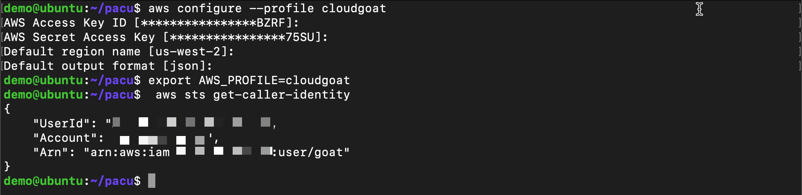

Build attacker machine
======================

Install common packages
+++++++++++++++++++++++

.. code:: console

    sudo apt-get update && sudo apt install -y ssh vim net-tools curl git python3-pip 

Install awscli
++++++++++++++

-  Download the package

.. code:: console

    curl "https://awscli.amazonaws.com/awscli-exe-linux-x86_64.zip" -o "awscliv2.zip"

-  Unzip the installer

.. code:: console

    unzip awscliv2.zip

-  Run the install program

.. code:: console

    sudo ./aws/install

Install terraform
+++++++++++++++++

-  Terraform Prerequisites

.. code:: console

    sudo apt-get update && sudo apt-get install -y gnupg software-properties-common

-  Add the HashiCorp GPG key

.. code:: console

    curl -fsSL https://apt.releases.hashicorp.com/gpg | sudo apt-key add -

-  Add the official HashiCorp Linux repository

.. code:: console

    sudo apt-add-repository "deb [arch=amd64] https://apt.releases.hashicorp.com $(lsb_release -cs) main"

-  Update to add the repository, and install the Terraform CLI
  
.. code:: console

    sudo apt-get update && sudo apt-get install terraform

Install Cloudgoat
+++++++++++++++++
-  Use git to clone the Cloudgoat repo to home directory and change to
   the new directory

.. code:: console     
   
    git clone https://github.com/RhinoSecurityLabs/cloudgoat.git ~/cloudgoat && cd ~/cloudgoat
   
-  Install the Cloudgoat dependencies

.. code:: console

    pip3 install -r ./core/python/requirements.txt && chmod u+x cloudgoat.py

Install Pacu
++++++++++++

-  Use git to clone the Pacu repo to home directory and change to the
   new directory

.. code:: console

    git clone https://github.com/RhinoSecurityLabs/pacu.git ~/pacu && cd ~/pacu

-  Install the Pacu dependencies
 
.. code:: console      
   
    pip3 install -r requirements.txt

Setup AWS Profile
+++++++++++++++++

-  Setup AWS profile for Cloudgoat. This account will need admin access
   in AWS. This will create or add a new profile in ``~/.aws/config``
   and ``~/.aws/credentials``

-  You will be prompted for
   ``Access Key ID, AWS Secret Access Key, Default region name, Default output format``

.. code:: console

    aws configure --profile cloudgoat

-  Make the new aws profile your default

.. code:: console

    export AWS_PROFILE=cloudgoat

-  Verify credentials are working

.. code:: console

    aws sts get-caller-identity

Setup Cloudgoat
+++++++++++++++

- Run Cloudgoat config profile from home directory and set default
  profile. You will be prompted to enter an AWS profile from the
  previous step which we called ``cloudgoat``. This is how Cloudgoat
  will access AWS. 
      
.. code:: console
      
    ~/cloudgoat/cloudgoat.py config profile

- Run Cloudgoat config whitlelist
   
.. code:: console

    ~/cloudgoat/cloudgoat.py config whitelist --auto

Create vulnerable infrastructure
++++++++++++++++++++++++++++++++

- Now that the tools are setup we will use Cloudgoat to setup vulnerable
  infrastructure in AWS. This will create our scenario

-  Run the attack scenario

.. code:: console
   
    ~/cloudgoat/cloudgoat.py create lambda_privesc

- Collect the 3 outputs and copy them to a text file:
   - cloudgoat_output_aws_account_id
   - cloudgoat_output_chris_access_key_id
   - cloudgoat_output_chris_secret_key